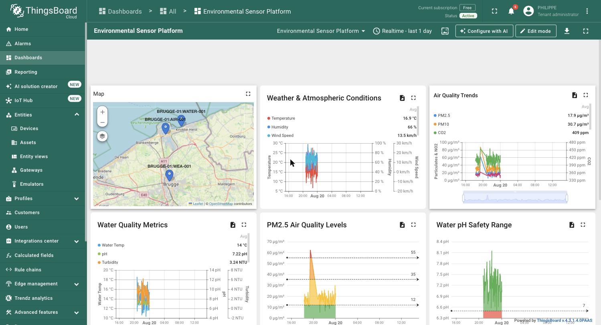
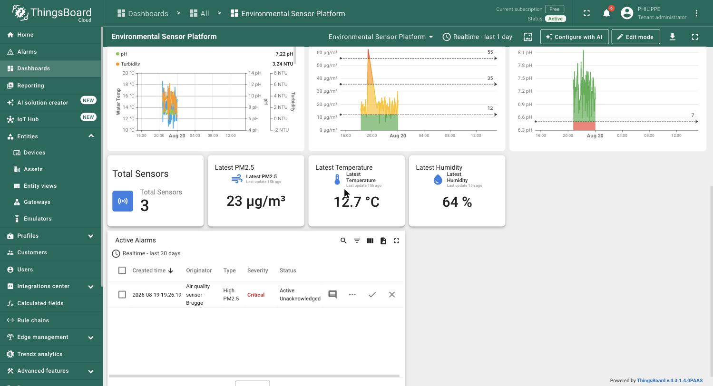
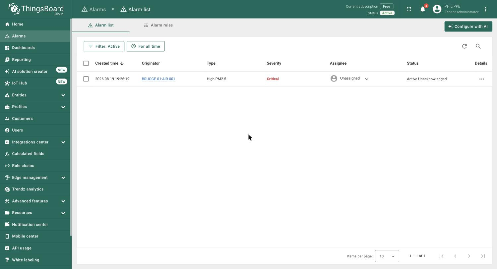

# Environmental Sensor Data Platform

[](https://github.com/phlppgdfry/environmental-sensor-data-platform/actions/workflows/ci.yml)
[](LICENSE)

Automatically mirrored to GitLab on every push to `main` (via the
`mirror-to-gitlab` job in `.github/workflows/ci.yml`, authenticated with a
project-scoped GitLab access token stored as a GitHub Actions secret — no
manual sync step): https://gitlab.com/phlppgdfry/environmental-sensor-data-platform
(`.gitlab-ci.yml` runs the same lint/test/build/report pipeline there).
The generated sample report is published permanently via GitLab Pages:
https://environmental-sensor-data-platform-e2cbb8.gitlab.io/

Production-style Python data platform demonstrating automated sensor
provisioning, ThingsBoard integration, telemetry processing, data-quality
validation and environmental reporting — built around a realistic
environmental-monitoring use case involving hundreds to thousands of IoT
sensors (air quality, water quality, noise, weather).

It mirrors a common public-sector data pipeline: asset data comes out of a
materials/asset-management system as CSV, sensors are provisioned in
ThingsBoard, telemetry is ingested and validated, and Python scripts produce
recurring reports and dashboards — all runnable locally via Docker and wired
into CI (GitLab and GitHub Actions).

`integrations/thingsboard/telemetry.py` was verified against a real
ThingsBoard Cloud tenant (not just the mocked test suite) — every device,
alarm, dashboard widget, rule chain, calculated field and notification rule
below was provisioned by this repo's code or its `tb` CLI automation, with
no manual data entry in the ThingsBoard UI beyond initial widget layout:



KPI tiles and an active-alarms table sit below the fold on the same
dashboard, giving an at-a-glance fleet status next to the historical trends:



The device profile also carries a real alarm rule (`pm25 > 35` → Critical),
and a customer ("Zeebrugge Port Authority") the dashboard is shared with —
so the loop from provisioning through alerting to stakeholder reporting is
fully wired, not just the happy-path telemetry pipeline:



### ThingsBoard operations beyond telemetry

Past ingesting and displaying data, the tenant is wired up the way a real
operations deployment would be:

- **Rule engine**: a standalone `Anomaly Webhook Routing` rule chain
  (`TbJsFilterNode` → `TbRestApiCallNode`) filters incoming telemetry for
  out-of-range PM2.5, pH or turbidity and forwards the anomalous message to
  an external webhook — kept separate from the Root Rule Chain so it can be
  demoed without touching the live save/alarm path.
- **Calculated Fields**: an `Air Quality Index` SIMPLE calculated field runs
  server-side on the air quality device, combining `pm25`/`pm10`/`no2` into
  one derived metric — ThingsBoard's native aggregation alongside this
  repo's own Python-side analytics.
- **Notification Center**: a notification rule watches the `High PM2.5`
  alarm (CRITICAL severity) and pushes an in-app notification to tenant
  admins — alerting isn't just a red row in a table, it reaches a person.
- **Entity Groups over "Change owner"**: the sensors and the dashboard live
  in tenant-owned `Zeebrugge Sensors` / `Zeebrugge Dashboards` entity
  groups, shared **read-only** with the Zeebrugge Port Authority customer —
  a scoped, auditable grant instead of transferring entity ownership
  outright.

All of the above (dashboard widgets, rule chain, calculated field,
notification rule, entity groups) was provisioned via the `thingsboard-cli`
(`tb`) and direct REST calls reusing its authenticated client — not the
ThingsBoard web UI — so it's reproducible from a terminal.

## Architecture

```text
Asset Management
      |
     CSV
      v
+-----------------+
| Import Pipeline |  validation, mapping, idempotent upsert
+--------+--------+
         v
+-----------------+
|   ThingsBoard   |  device provisioning (JWT) + telemetry (device token)
+--------+--------+
         | telemetry
         v
+-----------------+
| Ingestion       |  wide -> long normalization, dedup
+--------+--------+
         v
+-----------------+
| PostgreSQL      |
+--------+--------+
         v
+-----------------+
| Pandas / NumPy  |  aggregation, data-quality, anomaly detection
+--------+--------+
         v
+-----------------+
| Plotly Reports  |  HTML reports, Streamlit dashboard
+-----------------+
```

## Why two ThingsBoard auth flows

ThingsBoard has two separate authentication planes and this repo models
both, deliberately, in separate modules:

- **Management plane** (`integrations/thingsboard/client.py`,
  `devices.py`) — device provisioning and server-side attributes, backed by
  a **JWT bearer token** from `/api/auth/login`. The client auto-refreshes
  the token and retries once on `401`, and separately retries transient
  connection errors and `429`/`5xx` responses with exponential backoff
  (4xx client errors are not retried — they won't succeed on repetition).
- **Device plane** (`integrations/thingsboard/telemetry.py`) — a sensor
  publishing its own telemetry over HTTP, authenticated with a **per-device
  access token**, no user JWT involved. `integrations/thingsboard/telemetry_mqtt.py`
  covers the same device plane over **MQTT** instead — the transport a real
  sensor fleet or gateway is more likely to speak than one-off HTTP POSTs,
  with a persistent connection and QoS delivery.

## API

`api/app.py` exposes the same analytics layer the dashboard and report
scripts use, over HTTP (FastAPI):

```bash
uvicorn sensor_platform.api.app:app --reload
```

- `GET /projects` — known project IDs
- `GET /reports/{project_id}` — metric summary + lowest-uptime sensors (404
  for an unknown project)
- `GET /anomalies?project_id=&threshold=&limit=` — z-score anomalies,
  optionally scoped to one project

This is a thin read layer, not a second copy of the logic — it's the
project moving from "a set of scripts" to "a service" a frontend or another
system could depend on.

## Project layout

```text
src/sensor_platform/
    config/            # pydantic-settings, .env driven
    models/            # Device, Project, TelemetryReading (pydantic)
    imports/           # CSV validation, mapping, streamed idempotent importer
    integrations/
        thingsboard/   # JWT client, device provisioning, HTTP + MQTT telemetry
    ingestion/         # wide->long processing, PostgreSQL pipeline
    analytics/         # aggregation, data quality, anomaly detection
    reporting/         # Plotly/Matplotlib charts, HTML report generator
    simulator/         # synthetic sensor + telemetry generator (load testing)
    db/                # SQLAlchemy schema + session
    api/               # FastAPI read layer over the analytics functions

scripts/               # CLI entry points (Typer)
dashboard/              # Streamlit dashboard
tests/                  # pytest suite (unit tests, no live services needed)
tests/integration/      # live PostgreSQL/ThingsBoard tests, see CI/CD below
```

## Quickstart

```bash
python -m venv .venv && source .venv/bin/activate
pip install -e ".[dev]"

# spin up PostgreSQL + ThingsBoard locally
docker compose up -d

# generate synthetic assets + telemetry
python scripts/simulate_sensors.py --sensors 1000 --hours 24

# provision devices in ThingsBoard from the generated CSV (idempotent)
python scripts/import_assets.py data/generated/assets.csv

# generate an HTML + CSV report for a project
python scripts/generate_report.py --project BRUGGE-01

# interactive dashboard
streamlit run dashboard/app.py
```

Run the test suite (no live ThingsBoard/Postgres needed — the ThingsBoard
client is tested against a mock HTTP transport):

```bash
pytest
ruff check src tests scripts dashboard
mypy src
```

Install the pre-commit hooks (ruff + mypy run automatically before each
commit):

```bash
pre-commit install
```

## Data quality & robustness

The simulator deliberately injects the kind of mess real sensor fleets
produce, so the analytics layer has something real to catch:

- missing/dropped readings
- duplicate telemetry (same sensor + timestamp)
- out-of-range outliers (physically implausible values)
- sensors that go fully offline mid-run

`analytics/quality.py` computes per-sensor uptime, flags out-of-range
readings against physical bounds, and detects gaps in a sensor's timeseries.
`analytics/anomalies.py` adds z-score, IQR and fixed-threshold anomaly
detection on top.

CSV import (`imports/csv_importer.py`) and device provisioning
(`integrations/thingsboard/devices.py`) are both **idempotent**: re-running
the same import does not create duplicate devices — existing devices are
matched by name and only updated when their attributes actually changed.

The import is also **streamed**: `import_assets_csv` reads and provisions
the CSV in configurable chunks (`--chunk-size`, default 5,000 rows) instead
of loading the whole file into memory, and still catches a duplicate
`sensor_id` even when the two copies land in different chunks.

## Performance

```text
Sensors:             1,000
Telemetry records:   ~1,000,000  (24h @ 15 min intervals)
Generation time:     ~3-5 sec    (numpy-vectorized simulator)
```

Reproduce with:

```bash
python scripts/simulate_sensors.py --sensors 1000 --hours 24 --interval-minutes 15
```

## CI/CD

- `.gitlab-ci.yml` — lint (ruff/mypy) -> test (pytest + coverage) -> **live
  integration tests** -> Docker build -> generates a sample report ->
  publishes it to GitLab Pages, all on the default branch and on a daily
  scheduled pipeline (Build > Pipeline schedules) so the published report
  never goes stale.
- `.github/workflows/ci.yml` — lint/test/report for GitHub-hosted review,
  plus a `mirror-to-gitlab` job that keeps the GitLab mirror in sync
  automatically on every push to `main`.

### Live integration tests

`tests/integration/` runs the same provisioning and telemetry code paths
against **real** services instead of a mocked HTTP transport: a
`postgres:16-alpine` service container, and a `thingsboard/tb-postgres`
service container that installs its schema and demo tenant on first boot.
They're marked `@pytest.mark.integration`, excluded from the default
`pytest` run (`-m 'not integration'`), and skip individually if
`DATABASE_URL` / `THINGSBOARD_BASE_URL` aren't set — so `pytest` locally
stays fast and hermetic, while CI's `integration` job runs them for real:

```bash
DATABASE_URL=postgresql+psycopg2://... THINGSBOARD_BASE_URL=http://... pytest -m integration
```

## Tech stack

Python 3.12 - Pandas - NumPy - Plotly - Matplotlib - Pydantic - httpx -
FastAPI - paho-mqtt - SQLAlchemy - PostgreSQL - ThingsBoard - Docker -
pytest - ruff - mypy - pre-commit - Streamlit - Typer - GitLab CI / GitHub
Actions / GitLab Pages
