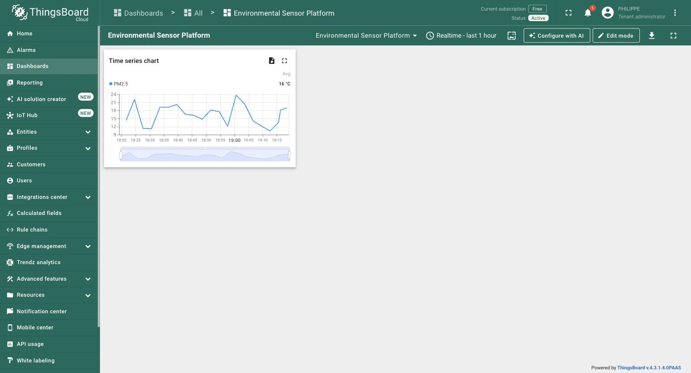

# Environmental Sensor Data Platform

Production-style Python data platform demonstrating automated sensor
provisioning, ThingsBoard integration, telemetry processing, data-quality
validation and environmental reporting — built around a realistic
environmental-monitoring use case involving hundreds to thousands of IoT
sensors (air quality, water quality, noise, weather).

It mirrors a common public-sector data pipeline: asset data comes out of a
materials/asset-management system as CSV, sensors are provisioned in
ThingsBoard, telemetry is ingested and validated, and Python scripts produce
recurring reports and dashboards — all runnable locally via Docker and wired
into CI (GitLab and GitHub Actions).

`integrations/thingsboard/telemetry.py` was verified against a real
ThingsBoard Cloud device (not just the mocked test suite) — the widget below
was populated entirely by this repo's `TelemetryPublisher`, with no manual
data entry in the ThingsBoard UI:



## Architecture

```text
Asset Management
      |
     CSV
      v
+-----------------+
| Import Pipeline |  validation, mapping, idempotent upsert
+--------+--------+
         v
+-----------------+
|   ThingsBoard   |  device provisioning (JWT) + telemetry (device token)
+--------+--------+
         | telemetry
         v
+-----------------+
| Ingestion       |  wide -> long normalization, dedup
+--------+--------+
         v
+-----------------+
| PostgreSQL      |
+--------+--------+
         v
+-----------------+
| Pandas / NumPy  |  aggregation, data-quality, anomaly detection
+--------+--------+
         v
+-----------------+
| Plotly Reports  |  HTML reports, Streamlit dashboard
+-----------------+
```

## Why two ThingsBoard auth flows

ThingsBoard has two separate authentication planes and this repo models
both, deliberately, in separate modules:

- **Management plane** (`integrations/thingsboard/client.py`,
  `devices.py`) — device provisioning and server-side attributes, backed by
  a **JWT bearer token** from `/api/auth/login`. The client auto-refreshes
  the token and retries once on `401`.
- **Device plane** (`integrations/thingsboard/telemetry.py`) — a sensor
  publishing its own telemetry, authenticated with a **per-device access
  token**, no user JWT involved.

## Project layout

```text
src/sensor_platform/
    config/            # pydantic-settings, .env driven
    models/            # Device, Project, TelemetryReading (pydantic)
    imports/           # CSV validation, mapping, idempotent importer
    integrations/
        thingsboard/   # JWT client, device provisioning, telemetry publisher
    ingestion/         # wide->long processing, PostgreSQL pipeline
    analytics/         # aggregation, data quality, anomaly detection
    reporting/         # Plotly/Matplotlib charts, HTML report generator
    simulator/         # synthetic sensor + telemetry generator (load testing)
    db/                 # SQLAlchemy schema + session

scripts/               # CLI entry points (Typer)
dashboard/              # Streamlit dashboard
tests/                  # pytest suite (unit tests, no live ThingsBoard needed)
```

## Quickstart

```bash
python -m venv .venv && source .venv/bin/activate
pip install -e ".[dev]"

# spin up PostgreSQL + ThingsBoard locally
docker compose up -d

# generate synthetic assets + telemetry
python scripts/simulate_sensors.py --sensors 1000 --hours 24

# provision devices in ThingsBoard from the generated CSV (idempotent)
python scripts/import_assets.py data/generated/assets.csv

# generate an HTML + CSV report for a project
python scripts/generate_report.py --project BRUGGE-01

# interactive dashboard
streamlit run dashboard/app.py
```

Run the test suite (no live ThingsBoard/Postgres needed — the ThingsBoard
client is tested against a mock HTTP transport):

```bash
pytest
ruff check src tests scripts dashboard
mypy src
```

## Data quality & robustness

The simulator deliberately injects the kind of mess real sensor fleets
produce, so the analytics layer has something real to catch:

- missing/dropped readings
- duplicate telemetry (same sensor + timestamp)
- out-of-range outliers (physically implausible values)
- sensors that go fully offline mid-run

`analytics/quality.py` computes per-sensor uptime, flags out-of-range
readings against physical bounds, and detects gaps in a sensor's timeseries.
`analytics/anomalies.py` adds z-score, IQR and fixed-threshold anomaly
detection on top.

CSV import (`imports/csv_importer.py`) and device provisioning
(`integrations/thingsboard/devices.py`) are both **idempotent**: re-running
the same import does not create duplicate devices — existing devices are
matched by name and only updated when their attributes actually changed.

## Performance

```text
Sensors:             1,000
Telemetry records:   ~1,000,000  (24h @ 15 min intervals)
Generation time:     ~3-5 sec    (numpy-vectorized simulator)
```

Reproduce with:

```bash
python scripts/simulate_sensors.py --sensors 1000 --hours 24 --interval-minutes 15
```

## CI/CD

- `.gitlab-ci.yml` — lint (ruff/mypy) -> test (pytest + coverage) -> Docker
  build -> generates a sample report as a pipeline artifact on the default
  branch.
- `.github/workflows/ci.yml` — mirrors the same pipeline for GitHub-hosted
  review.

## Tech stack

Python 3.12 - Pandas - NumPy - Plotly - Matplotlib - Pydantic - httpx -
SQLAlchemy - PostgreSQL - ThingsBoard - Docker - pytest - ruff - mypy -
Streamlit - Typer - GitLab CI / GitHub Actions
